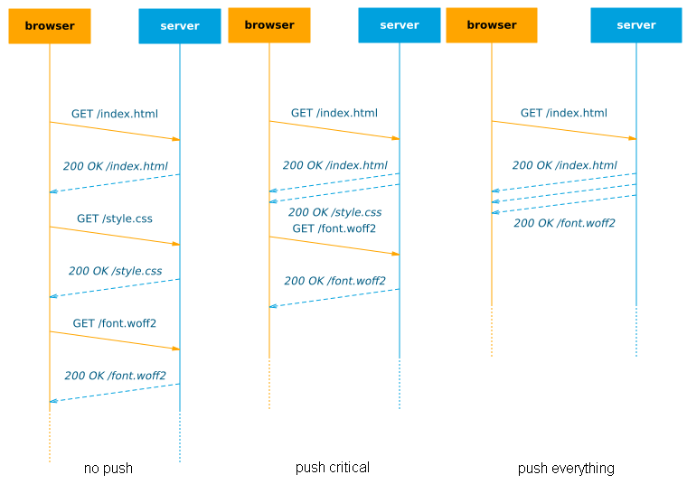

# REVIEW VERSION 0.2: please send comments and feedback to <a href="mailto:robin.marx@uhasselt.be" target="_top">robin.marx@uhasselt.be</a> or <a href="https://twitter.com/programmingart">@programmingart</a>

# HTTP/2 Push : The details

HTTP/2 (h2) is here and it tastes good! One of the most interesting new features is **h2 push**, which allows the server to send data to the browser without having to wait for the browser to explicitly request it first. 

This is useful because normally we need to wait for the browser to parse the .html file and discover the needed links before these resources can be sent. This typically leads to 2 Round-Trip-Times (RTTs) before data arrives at the browser (1 to fetch the .html, then 1 to fetch a resource). So with h2 push, we can **eliminate this exta RTT** and make our site faster! In this it is conceptually similar to inlining critical CSS/JS in the .html, but should give better **cache utilization**. It also helps to ensure **better bandwidth utilization** at the start of the connection. Plenty of posts talk [about][googledevOverview] [the][wikipediaOverview] [basics][grig2013], how to use [it][howtoPHP] [on][howtoIIS] [different][howtoNode] [platforms][howtoJava] and [how][debugChrome1] [to][debugChrome2] [debug][debugOverview] it.

[grig2013]: https://www.igvita.com/2013/06/12/innovating-with-http-2.0-server-push/   
[wikipediaOverview]: https://en.wikipedia.org/wiki/HTTP/2_Server_Push
[googledevOverview]: https://developers.google.com/web/fundamentals/performance/http2/#server_push

[howtoPHP]: https://blog.cloudflare.com/using-http-2-server-push-with-php/
[howtoIIS]: https://blogs.iis.net/davidso/http2
[howtoNode]: http://www.deanhume.com/Home/BlogPost/getting-started-with-http-2-and-server-push/10152
[howtoJava]: http://www.javaworld.com/article/2916548/java-web-development/http-2-for-java-developers.html?page=2

[debugChrome1]: chrome://net-internals/#events&q=type:HTTP2_SESSION
[debugChrome2]: https://bugs.chromium.org/p/chromium/issues/detail?id=464501
[debugOverview]: https://blog.cloudflare.com/tools-for-debugging-testing-and-using-http-2/

		

Figure 1: How push after index.html works **theoretically**

In an ideal world with unlimited bandwidth, we could theoretically just push all our resources with the .html, eliminating waiting for the browser completely (see Figure 1, right side)! Sadly, in practice, even pushing just a tad too much data can actually lead to significant slow downs in site loads. 

This post aims to look at some of the **low-level issues** that determine how useful push can be and how this impacts practical usage. The text should be comprehensible for relative newcomers to the topic, while more advanced readers can find in-depth information in the many [reference][akamaiAutomatingRUM] [links][rulesOfThumb] [and][promiseOfPush] [sources][kazuhoArchitecting] and reflect on the ideas in [chapter 2](#chapter2).

[kazuhoArchitecting]: http://www.slideshare.net/kazuho/reorganizing-website-architecture-for-http2-and-beyond 

### TL;DR
- h2 Push is [not production-ready yet](#chapter2.3), but excellent for experimentation!
- [TCP slow start](#chapter1.1), [resource priorities](#chapter1.2), [buffering](#chapter1.3) and [caching](#chapter1.4) conspire on a low level to make h2 push difficult to fine-tune
- Best practices for when to use [push vs Resource Hints](#chapter2.1) are unclear
- [Automated tooling](#chapter2.2) is probably going to be the preferred way to use push, especially on a CDN level 
- >> *The utility of push can be diminished if you just do the basics right (e.g. cache .html), but the problem that push solves will always be there. We should be thinking about h2 push as the insurance policy* - Colin Bendell

## 1. Underlying basic principles and limits 

The performance of h2 push is heavily dependent on the underlying networking protocols and other aspects of the h2 protocol itself. Here we introduce these principles on a comprehensible level to later discuss them more practically in [chapter 2](#chapter2). 

### 1.1 Bandwidth and TCP slow start 

On the internet, every connection has a limited amount of bandwidth. If we try to send too much data at once, the network will start discarding the excess to keep the link from getting flooded/congested (packet loss). For this reason, the reliable TCP protocol uses a mechanism [called][slowstart1] [slow][slowstart2] [start][slowstart3] which basically means we start by sending just a little bit of data at first and only increase our send rate if the network can handle it (no packet loss occurs). In practice, this initial **congestion window (cwnd)** is about **[14kB][initcwnd]** on most linux servers. Only when the browser confirms it has successfully received those 14kB (by sending ACK message(s)) will the cwnd double in size to **28kB** and we can send that much data. After the next AKCs arrive we can grow to **56kB** etc.

*note: in practice cwnd can grow in other ways too, but the behaviour is similar to the process described above, so we will use the [ACK][marsattacks]-based model as it's easy to reason about* 

[marsattacks]: http://img-9gag-fun.9cache.com/photo/aPMYYOR_460s.jpg

Figure 2: Impact of TCP slow start (compare to theoretical performance in Figure 1)

This means that on a **cold** connection, we can only send 14kB of data to the browser in the first RTT anyway: if we push more, it is buffered at the server until the browser ACKs these first 14kB. In that case, push can have no additional benefits: if the browser just issues a new request along with the ACKs, it would have a similar effect (*2 RTTs* needed to download the full resource, see figure 2). Of course, on a **warm**/reused connection, where the cwnd has already grown large, you can push more data in 1 RTT. A more in-depth discussion of this can be found in chapter 1 of **[this excellent document][rulesOfThumb]**. 

Note that this is primarily a problem because HTTP/2 uses just 1 connection vs 6 parallel connections in most HTTP/1.1 implementations. Interestingly, there are also [reports][increaseCWND] that increasing the initial cwnd doesn't help much for general HTTP/2, but it's unclear if this holds true with h2 push as well. 

[slowstart1]: http://www.isi.edu/nsnam/DIRECTED_RESEARCH/DR_HYUNAH/D-Research/slow-start-tcp.html
[slowstart2]: http://packetlife.net/blog/2011/jul/5/tcp-slow-start/
[slowstart3]: https://www.igvita.com/2011/10/20/faster-web-vs-tcp-slow-start/
[initcwnd]: https://tylercipriani.com/blog/2016/09/25/the-14kb-in-the-tcp-initial-window/
[rulesOfThumb]: https://docs.google.com/document/d/1K0NykTXBbbbTlv60t5MyJvXjqKGsCVNYHyLEXIxYMv0/
[increaseCWND]: https://speakerdeck.com/mgooding1981/velocity-santa-clara-h2-in-the-real-world?slide=28

### 1.2 Priorities

HTTP/2 only uses a single TCP connection on which it **multiplexes** data from different requests. To decide which data should be sent first if multiple resources are pending transmission, h2 employs **priorities**. Basically, each resource is given a certain order in which it has to be sent: for example .html is the most important, so it has a priority of 1, .css and .js get 2 and 3, while images get 4. 

If we have pending transmissions for multiple resources with the same priority, their data can be **interleaved**: the server sends a chunk of each in turn, see figure 3. This interleaving can lead to both resources being delayed, as it takes longer for them to fully download. This can work well for progressively streamed/parsed resources, such as progressive jpgs or .html, but possibly less so for resources that need to be fully downloaded to be used (e.g. .css, .js and fonts).

Figure 3: HTTP/2 priorities and interleaving

HTTP/2 prioritization is much more complex than these examples, sorting priorities into trees and also allowing interdependencies and weights for subtrees to help decide how bandwidth should be distributed (and how interleaving should be done). [Many][priorities1] [interesting][priorities2] [posts][priorities3] have been written on this. 

[comment]: <> (TODO: include? The exact values of the priorities and weights can have a major impact on general HTTP/2 performance, not just for push.)

[priorities1]: https://nghttp2.org/blog/2014/04/27/how-dependency-based-prioritization-works/
[priorities2]: https://nghttp2.org/blog/2014/11/16/visualization-of-http-slash-2-priority/
[priorities3]: https://blogs.akamai.com/2016/04/http2-enables-more-intelligent-resource-loading-via-stream-dependencies-but-its-not-as-simple-as-you.html

	
	

### 1.3 Buffers

Networks use a lot of **buffering** on all levels (routers, cell towers, OS Kernel, etc.) to handle **bursts of incoming data** which cannot be immediately transmitted. In most cases, once data is in one of these buffers, it's impossible to get it out or rearrange the data in the buffer. This can make it impossible to correctly apply the **HTTP/2 priorities**. As a contrived example, if we push 3 large images right after our .html, they can fill up the **send buffer**. The browser then parses the .html, discovers an important .css file and requests it. The server wants to send this before the rest of the images (because it blocks the page render), but can't because it is unable to access data in the buffers. Its only choice is to send the .css after some image data, effectively delaying it and the page load, see figure 4.   

Figure 4: Large buffers can cause critical data to be delayed. The server can only re-prioritize the userspace buffer.

One possible solution for this is **limiting the use of the kernel buffer** as much as possible and only give data to the kernel if it can be sent **immediately**, [as explained in detail by Kazuho Oku][tcpNotsentLowat]. This is only partly a solution however, since there can also be significant **[bufferbloat][bufferbloat1]** in the [network][bufferbloat2] [itself][bufferbloat3]. If the network allows the server to send at a high rate, only to then stall the transmitted data in large internal buffers along the network path, we will see the same detrimental effect. This becomes a greater problem for *warm* connections, that can have more data in-flight at the same time. This issue is discussed further by google engineers in chapter 2 of **[this excellent document][rulesOfThumb]**. Interestingly, they argue that h2 push can also help with this issue, by pushing (only) critical resources in the correct order. This means knowing this **[exact order](#chapter2.2)** is important to get the most out of h2 push (and that pushing images directly after .html is probably a bad idea ;).    

[tcpNotsentLowat]: https://github.com/HTTPWorkshop/workshop2016/blob/master/talks/tcpprog.pdf 
[bufferbloat1]: http://cacm.acm.org/magazines/2012/1/144810-bufferbloat/fulltext
[bufferbloat2]: http://conferences.sigcomm.org/sigcomm/2012/paper/cellnet/p1.pdf
[bufferbloat3]: https://en.wikipedia.org/wiki/Bufferbloat
 

### 1.4 Caching 

Modern browsers (and network intermediaries like CDNs) make heavy use of caching to quickly load previously downloaded resources without having to issue a new request to the origin server. 
This of course means we don't want to push already cached resources, as this would **waste bandwidth** and might **delay other resources** that aren't cached yet. The problem is knowing which resources are cached; ideally the browser would send along a **summary of its cache** when requesting index.html, but this concept is not covered by the official HTTP/2 standard and not implemented in any browser at this moment. Instead, the official method is that the browser can signal the server to cancel a push with a so-called **RST_STREAM** reply to a PUSH_PROMISE. However, in practice, [(some) browsers don't do this either][akamaiAutomatingRUM], and will happily accept pushes for resources they have already cached. Even if they would use RST_STREAM, we can question how effective it would be: much (or all) of the data of the push can already be **en-route/buffered** before the RST_STREAM arrives at the server, possibly rendering it largely void.

Figure 5: RST_STREAM can be used to cancel h2 push ([source][promiseOfPush])

[promiseOfPush]: http://cdn.oreillystatic.com/en/assets/1/event/167/The%20promise%20of%20Push%20Presentation.pdf

To work around these shortcomings while we wait for an [official browser implementation][cachedigest], several options have been proposed, see chapter 3 of **[this excellent document][rulesOfThumb]**. The canonical concept is to [have the server set a cookie][casper1] [detailing which resources it has pushed][casper2] and check this cookie for each request to see what push targets remain. This seems to work well in practice, though it can fail if resources are removed from the client's cache in the meantime. 

[cachedigest]: https://tools.ietf.org/html/draft-ietf-httpbis-cache-digest-00
[casper1]: http://blog.kazuhooku.com/2015/10/performance-of-http2-push-and-server.html
[casper2]: https://www.shimmercat.com/en/blog/articles/cache-digests/

## 2. Practical implications

Now that we have a good understanding of the underlying principles at work, we can look at how these affect using h2 push in practice. 

### 2.1 When to push?

"When to push?" is difficult to answer and depends on your goals. I can see roughly **4 major possibilities** (see Figure 6), each with their own downsides :
 
  
 1. __After-Html__: Directly **after** index.html (benefit limited to: cwnd - size(index.html))   
 2. __Before-Html__: **Before**/while waiting for index.html (can slow down actual .html if wrongly prioritized/buffered)  
 3. __With-Resource__: **Alongside** another resource (can be non-optimal but easier to get order/priorities right)  
 4. __During-Interactive__: **After** page fully loaded (not for improving key pageload metrics)

Figure 6: Various times when push can be used

**Initial page load**

It seems that __After-Html__ is what [most people think about][PRPL] when talking about push, while it's arguably the least useful in the list, especially on cold connections (see [1.1](#chapter1.1)). Conversely, __Before-Html__ is a lot more interesting: we can actually **increase the congestion window up-front**, so that even large .html responses can be sent in a single RTT when they become available. Especially in the case of CDNs/edge servers this can work well if the origin is far away/slow: because of the small RTT between client and edge, the cwnd can grow quite quickly. It is **difficult to fine-tune** though: if we push too much we might fill up the buffers ([1.3](#chapter1.3)) and might not be able to prioritize the .html correctly. [Colin Bendell][promiseOfPush] created **[shouldipush.com](www.shouldipush.com)** to help you assess the gains your site can make if pushing before index.html (before "TTFB: time to first byte") and after index.html (before "TTFR: time to first resource")(see Figure 7). 

[PRPL]: https://developers.google.com/web/fundamentals/performance/prpl-pattern/

Figure 7: Opportunities to increase bandwidth utilization ([source][promiseOfPush])

__With-Resource__ could be a little less optimal for faster first load, but this approach might make it (much) easier to manage what to push and limit the risks of delaying other resources (see next in [2.2](#chapter2.2)) as resources are closely tied to other related data. For example in Figure 6, we know style.css will reference font.woff2, so we push it along whenever style.css is requested. This naive scheme means we don't have to worry about how style.css and font.woff2 fit into the larger "[dependency graph](#chapter2.2)", which makes the setup easier. A lot can go wrong here though and this is probably the least useful option.

**After load and across pages**

Finally we have __During-Interactive__, which is often ignored and considered controversial by some because there seems to be a direct, more attractive competitor: **"[Resource Hints][yoavResourceHints]"** (which you may know as `<link rel="preload/prefetch">`). Using Resource Hints can trigger the browser to fetch a resource before it needs it, both for the current page load and the next. It's often seen as superior to push because among others it works cross origin, doesn't suffer from the (current) [caching problems](#chapter1.4) and the browser can better decide how to fit it into the download schedule. So after the page is fully loaded and we have some javascript running, we might as well fetch any resource we need via Resource Hints instead of pushing them. It is worth mentioning though that Resource Hints can suffer from the **same limitations as push**, especially in dealing with h2 priorities and excessive buffering ([chapter 5][rulesOfThumb]). 

[yoavResourceHints]: https://yoavweiss.github.io/preload_and_preloaders_velocity_ams/#1

Seeing Resource Hints and push as **complementary options**, I feel there is a lot of room for experimentation here and cases where push can have its place. For example, in academic literature, many papers have investigated push to **[speed-up video][paperKpush] [segment delivery][paperDash2M]**. The MPEG-DASH standard streams videos in small segments (e.g. 2s) and instead of waiting for the browser to request the next segment (in time before the playback of the current one finishes), we can use push to instead **send available (live) segments immediately**. Another interesting paper is [MetaPush][paperMetaPush]: the researchers push so-called "meta files" which contain information about resources used in future pages and then use Resource Hints to download them. This should **combine the best of both worlds** and prevent excessive bandwidth usage.  

[paperDash2M]: http://dl.acm.org/citation.cfm?id=2964313
[paperKpush]: http://dl.acm.org/citation.cfm?id=2578277
[paperMetaPush]: http://conferences.sigcomm.org/sigcomm/2015/pdf/papers/allthingscellular/p57.pdf

In the field, **[Facebook has been using push in their native app][facebookPush]** to quickly load images/video, as an app has no critical js/css to load first. While Facebook's image use case looks more like __After-Html__, push could also be employed in a (Single Page) app context to send along resources with data updates, e.g. when the app fetches the latest content.json which references some images, they can be pushed along. 

At Velocity Amsterdam 2016, Amazon's Cynthia Mai talked about how **[Amazon aggressively prefetches resources][amazonPrefetch]** to speed up next-page load, but that `<link rel="prefetch">` was **too unpredictable and didn't scale** to large amounts of resources (as it seems to only fetch during browser idle time). A smart push scheme could be a more reliable option in this case, as you have **more control** over what is actually sent. In addition, though I haven't found many [good][swPushCASPER1] [examples][swPushCAPSER2] of this, combining push with **service workers** can be a very powerful concept that can also help with the current caching issues. Finally, I've seen it mentioned several times that an origin server might also **push updated resources to the CDN edge**, which could make for a lower-overhead API between the two.  

[facebookPush]: https://atscaleconference.com/videos/http2-server-push-lower-latencies-around-the-world/
[amazonPrefetch]: http://conferences.oreilly.com/velocity/devops-web-performance-eu/public/schedule/detail/54500 
[swPushCASPER1]: https://mariusgundersen.net/module-pusher/
[swPushCAPSER2]: http://jxck.hatenablog.com/entry/service-worker-casper 

### 2.2 What to push?

As discussed in [1.2](#chapter1.2) and [1.3](#chapter1.3), push can slow down the initial page load if we push too much or in the wrong order, as data can get stuck in buffers and (re-)prioritization can fail. 
To get it right, we need a very detailed overview of the order in which resources are loaded. 

**Dependency graphs**

This load order is related to the **"dependency graph"**, which specifies resource interdependencies. While this is quite simple in concept (simply build a tree by looking at the child resources each parent resource includes), in practice these graphs can be quite complex (See Figure 8). The very interesting **[Polaris paper from MIT][paperPolaris]** looks into how you can distill a correct dependency graph and shows that just by loading resources in the correct order/with correct priorities, page load times could be improved by **34% at the median** (even without using server push or dedicated browser support!).

[paperPolaris]: http://web.mit.edu/ravinet/www/polaris_nsdi16.pdf 

Figure 8: Real dependency graphs can be very complex and lead to unexpected optimal resource priorities and load orders ([source][paperPolaris])

Manually creating a correct dependency graph can be difficult, even if we're just looking at the critical resources. Some [basic tools][pushManifestTool] already exist to partly help you with this, popular frameworks like [webpack][webpackDependencies] also keep some dependency information and Yoav Weiss is reportedly looking into [exposing dependency info via the Resource Timing API][yoavDependencyTrees] (as dependencies and priorities can be different between browsers). 

To then use your constructed graph to decide what to push and what to load normally/via Resource Hints is even more difficult. [The most extensive work I've seen on this comes from **Akamai**][akamaiAutomatingRUM]. They use collected **Resource Timing data from RUM** (Real User Monitoring) to extract the dependency graph and then statistically decide which resources should be pushed. The integration into their CDN means they can also watch out for (large) **regressions** from push and adapt accordingly. Their approach shows how difficult it can be to properly leverage push and to what lengths you need to go to optimize its operation. Alternatively, [CloudFlare discussed pros and cons][cloudflarePush] of other ways a CDN can provide push. 

[pushManifestTool]: https://github.com/GoogleChrome/http2-push-manifest
[webpackDependencies]: https://webpack.github.io/docs/code-splitting.html
[yoavDependencyTrees]: https://www.w3.org/2016/09/23-webperf-minutes.html#item06
[akamaiAutomatingRUM]: https://edge.akamai.com/ec/us/highlights/developer-track-videos.jsp#edge_2016_dev_track_automating_h2_push.mp4
[cloudflarePush]:https://github.com/HTTPWorkshop/workshop2016/blob/master/talks/server-push.pdf

While waiting for advanced supporting tools, we are stuck with mostly the manual methods, and many server/framework implementations primarily look at **critical resources at initial page load as the main use-case for push** (probably since they are easiest to manually fine-tune), see [2.3](#chapter2.3). It is here that [__With-Resource__](#when3) can make it easier (if used conservatively): if we just push direct child dependencies along with a resource, we don't need to keep the overview of the full dependency graph. This is especially interesting for sites where individual teams work on **small feature "pagelets" that [combine into a larger site][zalandoTailor]**. 

Note that these dependency graphs are also needed to optimally profit from Resource Hints!

[zalandoTailor]: https://github.com/zalando/tailor

**Warm connections and caching**

Getting the push order right is particularly important for cold connections and first page loads (nothing cached). For warm connections or in case many critical resources have already been cached, we suddenly get **a lot more options** because we can now push non-critical things: do we first push ad-related resources? our hero image or main content image(s)? Do we start pre-loading video segments? social integrations/comments section? I think it depends on the type of site you run and what experience you want to prioritize for your users. I feel that it is in these situations push will really start to shine and can provide significant benefits.  

I haven't seen much material that looks into how push behaves on warm connections/cross pages in practice (except, of course, for **[this excellent document][rulesOfThumb]**, chapter 1), which is probably because of the caching issues and the fact that it's more difficult to test with existing tools. Because of the many possible permutations and trickiness of push, I predict it will be some time before we see this being used properly. [Akamai's RUM-based system][akamaiAutomatingRUM] also doesn't include this yet because they are focusing on the other use cases first and because:

>> *The goal is a) predicting next page correctly b) not burning up a cellular user's data plan. and c) without overcharging our customer for data that an end user doesn't request (getting the push wrong). This was the failure of the 'prerender' resource hint. We can do a) really well and can predict next page with high confidence. But since it's not 100% guaranteed, the blowback from b) and c) are of great concern.* - Colin Bendell

 

Figure 9: Pushing can look very different over warm connections and/or with cached critical resources

This "wealth of options" becomes even larger if we start **prefetching** assets for future page loads, as more will be cached and we need to go further and further down the dependency graph for knowing what to push. To make optimal use of this prefetching scheme, we do need to employ some good **prediction algorithms**. For some sites this will be trivial (Amazon's product list will probably lead to a detail view somewhere down the line), but other sites might need to use a statistical/machine learning system to predict how users will traverse through their pages. This can of course have deep integrations with the already discussed [RUM-controlled push scheme][akamaiAutomatingRUM].

[comment]: <> (SPA code splitting (lazy load of routes + prediction = bingo!))

**Fine-grained pushing/streaming**

Up to this moment, we have primarily considered resources as single files which need to be **downloaded fully to be used**. While this is true for some resource types (.css, .js, fonts) others already allow streaming (.html, progressive images), where the browser starts using/processing the data incrementally/asap. For streamable resources, we might actually use resource interleaving (see [1.2](#chapter1.2)) to our benefit to get some version of the content displayed early on. 

For example, the h2o server [interrupts sending .html data][kazuhoArchitecting] when requests for .css come in. Akamai did [impressively in-depth research][akamaiProgressiveImages] on progressive images and the Shimmercat server uses a very nice implementation that allows you to [prioritize parts of (progressive) images][shimmercatProgressiveImages]. And of course, every browser progressively scans incoming .html for new links to request. 

[akamaiProgressiveImages]: http://cdn.oreillystatic.com/en/assets/1/event/158/Your%20hero%20images%20need%20you_%20Save%20the%20day%20with%20HTTP_2%20image%20loading%20Presentation.pdf
[shimmercatProgressiveImages]: https://www.shimmercat.com/en/docs/1.5/coordinated-image-loading/

If we can figure out how to make .js and [.css streamable][samSacconeStreamableCSS] or make tools to [split larger files][jakeArchibaldCSSLinks], we can move towards incredibly fine-grained pushing and get more use out of the low cwnds on cold connections ([1.1](#chapter1.1)). Advances in the [Streaming API][jakeArchibaldStreaming]/service workers might mean we don't even have to wait for browser vendors to start experimenting with this. 

[samSacconeStreamableCSS]: https://github.com/samccone/streaming-css
[jakeArchibaldCSSLinks]: https://jakearchibald.com/2016/link-in-body/
[jakeArchibaldStreaming]: https://jakearchibald.com/2016/streams-ftw/
		
	
	
	
### 2.3 How to push (2016)?

Up until now, we've been discussing the problems and opportunities of push without worrying (much) about what is **actually possible** in the current browser/server implementations. 
I don't think it's useful to try to give a full overview at this point, since things may look very different a few months from now. Instead I will give a non-exhaustive list of current problems/quirks/gotcha's to make the point that it might be a little too early to really use push in production. 

*note: some of these were overheard during conference questions and talks with others, so not everything has a hard reference.*

* **Priorities are very inconsistent**
   * HTTP/2 expects the client to specifcy resource priorities in the requests, while servers are allowed to adhere to them or not.
   * Firefox properly creates priority trees according to the spec ([dependency-based][browserPriorities4]), while chrome uses only very coarse priorities (weight-based only) and just 1 tree depth ([source1][browserPriorities1], [source2][browserPriorities2], [source3][browserPriorities3])
   * Because of this, the h2o server allows [bypassing of client priorities][browserPriorities3] to get the [expected behaviour][browserPrioritiesh2oReprioritize] (ex. send pushed .css/.js before .html, implying that push should only be used for critical resources). 
   * Akamai has said it will [prioritize .css/.js and adjust the prioritization of fonts][akamaiAutomatingRUM] in their automated push system.
   * The Shimmercat server uses a [learning/statistics based method][shimmercatPriorities] to determine dependency graphs and use them in prioritization.
   * Apache allows some [fine-grained settings][browserPrioritiesApache] but defaults to a very simple scheme that doesn't take into account browser differences.
   * At this point, there is no way to define custom priorities for the browser to follow (i.e. nothing like ``) and while this is being discussed, there are no concrete proposals yet.
   * A deeper discussion can be found in these mailing list threads: [thread 1][rulesOfThumbEmailThread1], [thread 2][firefoxPrioritiesEmailThread].
   
  [browserPriorities1]: https://speakerdeck.com/summerwind/2-prioritization
  [browserPriorities2]: http://blog.kazuhooku.com/2015/04/dependency-based-prioritization-makes.html
  [browserPriorities3]: http://www.slideshare.net/kazuho/h2o-making-http-better
  [browserPriorities4]: http://bitsup.blogspot.be/2015/01/http2-dependency-priorities-in-firefox.html
  [shimmercatPriorities]: https://www.ietf.org/mail-archive/web/httpbisa/current/msg27782.html
  [browserPrioritiesh2oReprioritize]: https://h2o.examp1e.net/configure/http2_directives.html#http2-reprioritize-blocking-assets
  [browserPrioritiesApache]: https://httpd.apache.org/docs/2.4/mod/mod_http2.html#h2pushpriority
  [rulesOfThumbEmailThread1]: https://www.ietf.org/mail-archive/web/httpbisa/current/msg27742.html
  [rulesOfThumbEmailThread2]: https://www.ietf.org/mail-archive/web/httpbisa/current/msg27921.html
  [firefoxPrioritiesEmailThread]: https://www.ietf.org/mail-archive/web/httpbisa/current/msg27742.html
   
* **Triggering push is inconsistent and too late**
   * Some frameworks/servers allow direct [programmatic access][howtoJava] to push via an API (ex. response.push(stream) in [nodejs][howtoNode]).
   * Most servers however are triggered to push when they receive a `Link: <resource.ext>; rel=preload;` header from the backend (ex. in [PHP][howtoPHP]). This is exactly the same header as we would use for preload Resource Hints, which makes it a bit confusing for new users, but also creates a nice fallback: if the server doesn't respect the push "command", the browser will still preload the resource. [You can use the `nopush` attribute to only get the preload behaviour](https://www.w3.org/TR/preload/#server-push-http-2). 
   * The problem with this setup is that the header can only be sent [if the full headers (and HTTP status code) for the "parent" resource are ready][kazuhoArchitectingEarlyHints]. In the case of .html, [we need to wait for the .html to be generated][promiseOfPush] and see if it is a 200 or 404 or 500 or ... to be able to send along the push headers. This precludes using the [__Before-Html__](#when2) usecase and defaults to [__After-Html__](#when1) (Note that this is not a limit of the HTTP/2 protocol, just from using headers to signal push).
   * To help with this problem and inter-operation with edge servers (and similar issues with Resource Hints in general), [Kazuho Oku proposed the **"103 Early Hints"** status code][earlyHintsSpec], which allows the server to send headers before the final headers are known. 
   
[earlyHintsSpec]: https://tools.ietf.org/html/draft-kazuho-early-hints-status-code-00
[kazuhoArchitectingEarlyHints]: http://www.slideshare.net/kazuho/developing-the-fastest-http2-server/51

* **Browsers disagree on the spec/don't fully implement it**  
   * Not all browsers have full implementations of H2 push yet (or even HTTP/2 itself for that matter). For example, not all of them agree which resources/responses can be pushed and not all of them correctly coalesce connections for "cross-origin" pushes that resolve to the same domain. 
   * [Colin Bendell][promiseOfPush] created the fantastic site [canipush.com][canipush] to help assess how different browsers react.
   * *Shoutout to Colin: an interface/overview akin to [www.caniuse.com](www.caniuse.com) would be interesting as well, so I don't have to open up all browsers on all platforms myself :)*
  
   [canipush]: http://www.canipush.com
  
* **Not all networks are the same**
   * Different networks have different bandwidth/delay properties, which impacts how fast the [TCP cwnd](#chapter1.1) will grow (and some networks even manipulate this growth for traffic shaping). When pushing, these differences should be taken into account and different push schemes might be needed depending on the prevalent network conditions. A list of common network "bandwidth delay products" can be found in [this excellent document][rulesOfThumb], end of chapter 1. They can range from 20kB for 2g to 156kB for cable, which can have a large impact on push performance. 
   * In the same document, the writers suggest that using push on a cold 2g connection will probably have no benefits for example, unless you have a very small .html file:
	>> We expect more relative improvement for faster connections than for slow connections, since faster connections generally have a higher BDP. It is unfortunate that this trend is not reversed.

  
* **Miscellaneous**
   
   * nginx doesn't support h2 push yet and [doesn't seem to have plans to change that any time soon][nginxSupport]. 
   
   * [PUSH_PROMISEs cannot be cancelled by the server][rulesOfThumbEmailThread2]
   
   * (Some) browsers currently don't send RST_STREAM messages for pushed resources that are already in cache.
   
   * Pushed resources are not used automatically. The browser still needs to request the resource for it to be evaluated (and executed). 
   
   * Pushed resources that the browser hasn't requested yet stay in a sort of separate "[unused streams][promiseOfPush]" waiting area for ~5 minutes, so aggressive prefetching for next pages can be problematic.  
   
   * PUSH_PROMISE messages need to contain "provisional headers", wherein the server tries to predict with which headers the browser will request the resource. If the server gets it wrong (e.g. the response depends on cookies) and the provisional headers don't match the browser-generated request headers, the pushed resource can be ignored by the browser and a second request is made ([source1][promiseOfPush], [source2][rulesOfThumb], [source3][akamaiAutomatingRUM], [source4][howToUsePush]).

   * Lists of resources to push are fundamentally de-coupled from the actual .html sent, so with wrong list-management we can easily push outdated assets (ex. still sending main.js?v=1 instead of main.js?v=2). Currently there are [no browser-based APIs][promiseOfPush] to programmatically catch this or to be alerted when a pushed resource remained unused (use chrome://net-internals to find unclaimed pushes). Without proper tooling, the wrong assets could be pushed for a long time before anyone noticing. 

   * Using HTTP/2 and push and improving cache-hits by splitting your files into smaller chunks can have unintended side-effects, [for example higher overall filesize][khanAcademy] due to [lower compression ratios][kazuhoArchitectingCompression]. 

   * [Kazuho Oku recommends not using load balancers / TLS terminators][kazuhoArchitecting] in combination with HTTP/2 push since they can introduce extra [buffering](#chapter1.3) in the network.
	
   * Push can use a lot of unnecessary bandwidth when used for non-critical assets (that might not be downloaded anyway). As such, in my opinion developers (and maybe servers) should respect the ["Save-Data" header][saveData] and be much more conservative about what they push if it is set. 
	
[nginxSupport]: https://www.nginx.com/blog/http2-r7/#comment-2302625444 
[khanAcademy]: http://engineering.khanacademy.org/posts/js-packaging-http2.htm
[kazuhoArchitectingCompression]: http://www.slideshare.net/kazuho/reorganizing-website-architecture-for-http2-and-beyond/41
[saveData]: https://developers.google.com/web/updates/2016/02/save-data
[howToUsePush]: https://http2.github.io/faq/#how-can-i-use-http2-server-push

## 3. Personal conclusions

After this wall of text, I still have the feeling many (important) details on h2 push remain undiscussed. Especially given that h2 push seems to only grant **limited performance gains** (especially for cold connections on slow networks) and can sometimes even [slow down your site][samSacconeSlower], [is it worth all this effort][worthIt]? If Akamai has to use a complex RUM-based data-mining approach to make optimal use of it and nginx doesn't consider it a priority, are we not doing exactly what [Ian Malcolm][ianChest] warned about in Jurassic Park? Shouldn't we just use Resource Hints and drop push? 

	

[worthIt]: https://daniel.haxx.se/blog/2016/07/25/a-workshop-monday/ 
[samSacconeSlower]: https://twitter.com/samccone/status/791312892503072768
[ianChest]: http://i.imgur.com/euFlC.jpg

While I would agree HTTP/2 push isn't ready for production yet (and, in my opinion, the same could be said to a lesser extent for HTTP/2 in general), I feel we're just getting to know these new technologies and how to best use them. It is said the [best laid plans of mice and men][bestLaidPlans] fail [at the first contact with the enemy][firstContact], and I feel the same applies for most new standards: even though many people have spent years thinking about them, things start to unravel fast when used in practice and at scale. This doesn't mean they don't have merit or potential, just that we **need more time to figure out best practices** (how long have we been optimizing for HTTP/1.1?).

[bestLaidPlans]: http://www.phrases.org.uk/meanings/the-best-laid-schemes-of-mice-and-men.html 
[firstContact]: https://en.wikiquote.org/wiki/Helmuth_von_Moltke_the_Elder

Many of the biggest current issues (e.g. cache-digest, early hints) will be solved soon and implementations will mature. Other underlying concepts such as dependency graphs, explicit prioritization, user behaviour prediction (for prefetch) and more fine-grained/interleaved streaming are useful **for many more techniques than just push** and will rise in the years to come. [QUIC][mattiasQuic], the next big protocol™, is heralded to help with the [buffering issues][rulesOfThumb], alongside offering many other interesting features. Interesting times lie ahead for webperf and I think h2 push will find its place in the end. 

[mattiasQuic]: https://ma.ttias.be/googles-quic-protocol-moving-web-tcp-udp/

For me personally, I hope to do some research/work on the following items in the months to come:
* How larger initial cwnds can affect push performance 
* (Cross page) push performance over warm connections and with cached critical assets 
* Using service workers as an orchestration/scheduling layer (+ using Streams API to go fine-grained)
* Completely bypass browser priorities and do full custom multiplexing on the server (~[Polaris][paperPolaris] from the server-side, i.e. by sending up-front PUSH_PROMISE for every known resource)
* The new [http2_server_push drupal module][drupalServerPush] (in cooperation with the great [Wim Leers][wimleers])

[drupalServerPush]: https://www.drupal.org/project/http2_server_push
[wimleers]: http://wimleers.com/article/performance-calendar-2015-are-cmses-fast-by-default-yet

I hope you've learned something from this post (I certainly have from the research!) and that you will start/continue to experiment with HTTP/2 push and join **[the webperf revolution][soudersParallell]**! 

[soudersParallell]: https://www.stevesouders.com/blog/2008/03/20/roundup-on-parallel-connections/

---
**Thanks to Colin Bendell and Maarten Wijnants for their help and feedback**

*Custom figures were made with https://mscgen.js.org/, https://draw.io and https://cloudconvert.com/svg-to-png.*

Last update: 30/11/2016  
Live version: https://rmarx.github.io/h2push-thedetails/ 